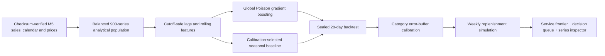

# Demand / Order

### A retail forecast that ends with a decision—not a score.


Demand / Order is a cutoff-safe demand forecasting and replenishment decision engine built on the public M5 dataset. It tests a global machine-learning model against the strongest calibration-selected seasonal baseline, then turns the forecast into a weekly service/inventory frontier and a planner-ready exception queue.

The verified 28-day holdout result across 900 item–store series:

| Outcome | Result |
|---|---:|
| Model WAPE | **49.5%** |
| Baseline WAPE | 51.9% |
| Relative improvement | **4.5%** |
| Revenue-weighted WAPE | 42.1% |
| Simulated fulfilled demand | **96.7%** |
| Difference vs baseline policy | **1,528 fewer lost units** |

The policy result is a unit-flow simulation, not a financial-savings claim. It also uses slightly more week-end inventory than the baseline; the dashboard makes that trade-off visible.

## The decision system



The project is designed to demonstrate the full work expected from a data analyst/AI engineer: data acquisition, quality controls, metric definition, leakage prevention, modeling, baseline discipline, uncertainty calibration, decision simulation, communication and product delivery.

## What is implemented

- automatic download of the three required public source tables
- published-checksum validation before analysis
- balanced, pre-evaluation series selection across all store/category cells
- price, calendar, event and SNAP joins
- demand lags and rolling statistics that are at least 28 days old at forecast time
- train/calibration/test separation
- global count-demand model and strongest-baseline selection
- WAPE, RMSE, bias and revenue-weighted WAPE
- calibrated weekly policy frontier
- operational queue ranked without using holdout actuals
- executed reader-facing notebook
- responsive React dashboard with real filters and series drilldowns
- Evaluation/Planning modes; Planning suppresses observed demand
- automated Python and browser QA

## Repository map

```text
├── data/                       # data card; raw CSVs are gitignored
├── src/demand_engine/          # data, feature, model, policy and payload pipeline
├── scripts/
│   ├── download_data.py        # Zenodo download + checksum verification
│   ├── run_pipeline.py         # full analytical pipeline
│   ├── build_notebook.py       # build + execute case-study notebook
│   └── browser_qa.mjs          # responsive interaction QA
├── notebooks/                  # executed case study
├── dashboard/                  # React + Vite decision interface
├── artifacts/                  # data-quality and evaluation contracts
├── docs/                       # model card, design evidence and portfolio claims
└── tests/                      # metric, artifact and policy tests
```

## Reproduce the result

Requirements: Python 3.11+ and Node 20.19+.

```powershell
python -m venv .venv
.\.venv\Scripts\python -m pip install -e ".[dev]"
.\.venv\Scripts\python .\scripts\download_data.py
.\.venv\Scripts\python .\scripts\run_pipeline.py
.\.venv\Scripts\python .\scripts\build_notebook.py
.\.venv\Scripts\python -m pytest -q
```

Run the dashboard:

```powershell
cd dashboard
pnpm install
pnpm dev
```

The committed dashboard payload is derived from the verified backtest so the UI can be reviewed without downloading the 323 MB source files.

## Read the evidence

- [Executed analytical notebook](notebooks/retail_demand_decision_engine.ipynb)
- [Model and policy card](docs/model-card.md)
- [Data card](data/README.md)
- [Interface fidelity ledger](docs/fidelity-ledger.md)
- [Portfolio and resume claim set](docs/portfolio-claims.md)

## Result boundaries

The source data is historical public US retail data. The experiment uses one sealed cutoff and 900 selected high-activity series. A production deployment would need rolling-origin validation, live inventory position, supplier lead-time distributions, MOQ/case-pack constraints, hierarchical reconciliation, cost calibration, drift monitoring and approval/audit controls.

